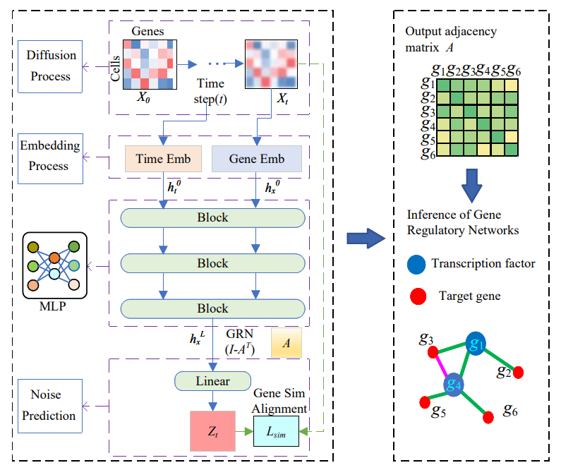

# DDPMGRN
</p>
DMGRN: Enhancing Diffusion Models for Gene Regulatory Network Inference

# Architecture



# Dependencies
- python >=3.8
- torch==2.1.0
- scanpy==1.9.1
- other detailed installation packages can be found in requirements.txt
- CUDA toolkit 11.0 or later.

# Installation
If you do not have Anaconda, please download and install Conda, then follow the steps below to create a Conda environment:
  (1) Clone the SIGRN repository from GitHub:
```
git clone https://github.com/lryup/DMGRN.git
```
  (2) Create a new environment:
```
conda create -n your_env_name python=3.8.0
  ```
  (3) Activate the environment:
```
conda activate your_env_name
 ```
  (4) Install the required packages:
 ```
pip install -r requirements.txt# It is recommended to install only the missing packages
 ```

# Data Preparation
In our study, we trained our model using all data from [BEENLINE](https://bcb.cs.tufts.edu/DAZZLE/BEELINE.zip).
You can download the datasets from the provided link. 
# Runing
The training command we used is as follows:
```
cd DMGRN  #Navigate to the current working directory
python run.py
```


# Usage

DMGRN accepts input data in CSV, TSV format, or H5AD format as provided by Scanpy (genes in rows and cells in columns for TSV and CSV). The output of the  GRN inference task includes an adjacency matrix and various evaluation metrics, such as AUC, EPR, and AUPRR.

# Baseline methods
- Beeline https://github.com/Murali-group/Beeline/tree/master
- DeepSEM https://github.com/HantaoShu/DeepSEM
- DAZZLE https://github.com/TuftsBCB/dazzle/tree/main
- RegDiffusion [https://github.com/TuftsBCB/dazzle/tree/main](https://github.com/TuftsBCB/RegDiffusion)

# References

- Thanks to the following authors for their papers and codes.

  [1] Pratapa, A., Jalihal, A.P., Law, J.N., Bharadwaj, A., Murali, T.: Benchmarking algorithms for gene regulatory network inference from single-cell transcriptomic data. Nature methods 17(2), 147–154 (2020)

  [2] Shu, H., Zhou, J., Lian, Q., Li, H., Zhao, D., Zeng, J., Ma, J.: Modeling gene regulatory networks using neural network architectures. Nature Computational Science 1(7), 491–501 (2021)

  [3] Zhu, H., Slonim, D.: Grn-vae: A simplified and stabilized sem model for gene regulatory network inference. bioRxiv pp. 2023–01 (2023)
  [4] H. Zhu and D. K. Slonim, “Improved gene regulatory network inference from single cell data with dropout augmentation,” PLOS Computational Biology, vol. 21, no. 10, p. e1013603, 2025.

  
